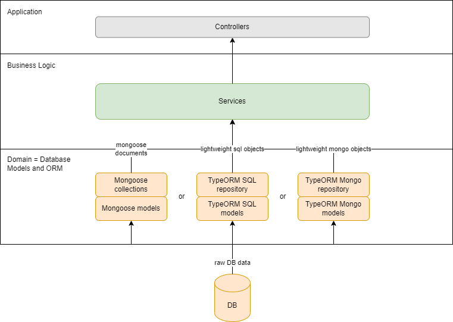
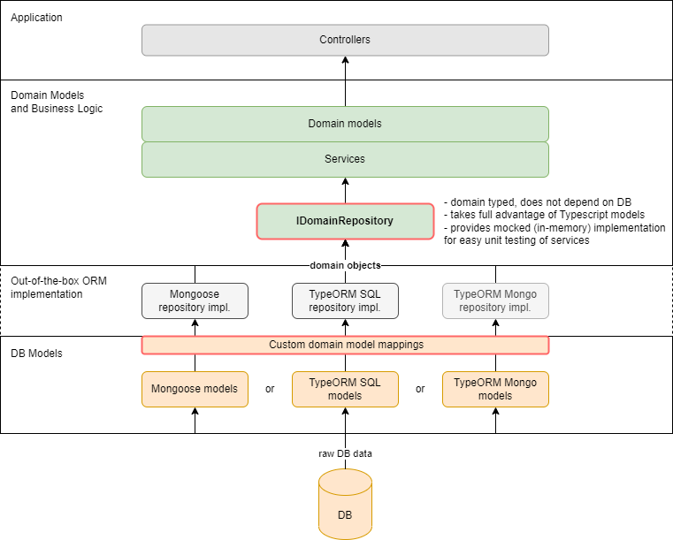

## Benefits of abstract repository

Properly implemented abstract repository layer solves 3 major development problems:

1. By hiding DB details, allows to easily switch between different databases. This pattern is called **DB as an implementation detail**.
2. Thanks to advanced Typescript checks, takes into consideration additional constraints such as optional and readonly properties, providing developers with **better intellisense and type-checking**.
3. **Greatly simplifies unit testing** by using out-of-the-box MockedDBRepository implementation.

---

## Comparison with standard approach

Classic back-end layered architecture consists of:

- controllers
- business services operating on database models
- database models and repositories (collections)

The main drawback of this approach is leaking database details (you often have to pollute your domain code and business functions with DB implementation details). This code is harder to design (DDD), harder to maintain and harder to test. The simplicity comes at the cost of violating some of the SOLID principles.

The TypeORM framework already improves this landscape, by decoupling models from database settings using Typescript decorators. Still, the business services must operate on TypeORM models and the person creating the business logic must know the exact database design (unless the custom mapper is used).



Abstract repository layer approach pushes TypeORM improvements even further, by introducing additional abstraction layer over specific DB implementation. The full architecture now consists of:

- controllers
- domain objects with optional and readonly properties
- business services operating on domain models, using **abtract repository interface**
- specific repository implementation for selected DBs\*
- db models and **custom object-entity mappings**

\*Mongoose MongoDb and TypeORM PostgreSQL are supported right now, more implementations will be added in future.



---

## Discussion

### 1. _What are benefits of DB as an implementation detail pattern?_

The main benefit of this approach comes from SOLID's Liskov substitution principle. You should program to interfaces wherever possible (especially when you can benefit from alternative implementation, for example during testing). You should treat DB technology as detail of your implementation and not your foundational architectural assumption. This obviously raises few doubts and questions:

- _I like my current database. Why would I ever change it?_ Because of market change, new company policy, new features needed, possible savings, scalability factors, team knowledge, etc. There are plenty of reasons, especially in later phases of development.

- _My current database technology matters._ The real question is: _when_ it matters? The success of the your project will mostly depend on your architecture, code quality, ability to change, complexity of your data model and design patterns used. The DB technology can only be a deciding factor in huge ecosystems and real edge cases. But even then it is better to have abstracted data layer.

- _I am using advanced database features._ Offloading too much work to DB engine is a dangerous practice, which can lead to huge maintenance problems. Remember that custom procedures and triggers are costly, maintainance and performance wise. Complex DB designs can be often simplified and most use-cases handled in code.

- _What if I never change my DB?_ Then you still can benefit from domain driven design and simplified testing.

### 2. _Which DB features does IDomainRepository support?_

IDomainRepository id DB agnostic and supports all DB features that are transparent to underlying ORM layer (Mongoose or TypeORM).

### 3. _Does IDomainRepository support nested objects and nested arrays?_

Yes, IDomainRepository supports nested objects and nested arrays.
If you wonder how those are implemented in concrete databases:

- nested primitive arrays:
  - MongoDb: supported out-of-the-box
  - PostgreSQL: as special array column type
- nested objects:
  - MongoDb: supported out-of-the-box
  - PostgreSQL: as additional table with one-to-one relationship
- nested object arrays:
  - MongoDb: supported out-of-the-box
  - PostgreSQL: as additional table with one-to-many relationship

### 4. _Which ORM functions does IDomainRepository support?_

[See API](https://github.com/lukaszwilisowski/domain-repository/blob/main/API.md) and Roadmap

### 5. _Is IDomainRepository performant?_

Yes, the performance of IDomainRepository is **equal** to the performance of underlying Mongoose or TypeORM repository, with a single exception: when updating **nested arrays and objects in SQL** database.

In this case we are using `save()` method, which can be slow in some circumstances (for example when updating a large number of nested elements). In most use-cases this performance drop is negligible. In cases, where it is not, please create a **separate IDomainRepository for nested object / array type** and run your functions from there.

### 6. _Why should I map DB objects to domain objects?_

Because of SOLID's Single-responsibility principle. You should not operate on objects, whose functions you do not need (for example heavy Mongoose documents). You should never pass more data than you need (for simplicity and security purposes). Also, the mapping gives you additional flexibility, decouples DB implementation from domain model, and allows to change both domain and DB models separately, without breaking the contract.

### 7. _Why object Id should be of type string?_

Because string id can be safely mapped from **any** database id:

- [string id] <- [MongoDb ObjectId]
- [string id] <- [SQL int id]

Also, identifies are usually read, assigned or compared, but not semantically processed. So in most circumstances there is no need to use different type than string. If there is, you can still use our repository, but as a consequence, you will not be able to switch to different database so easily.

### 8. _Why should I care for optional and readonly properties?_

To get most of Typescript compile-time checks. The better designed is your domain model, the better for everyone. Our repository checks that you do not run forbidden actions:

- check if _non_-optional property exists (makes no sense)
- clear _non_-optional property (makes no sense)
- update _readonly_ property (makes no sense)

### 9. _I already use specific businesss repositories. Why would I switch to IDomainRepository?_

Because you do not lose anything, and can still benefit from simplified testing and db inter-operability.

To step back. There are two main approaches to implementing repositories:

- using generic repositories (Mongoose collection, TypeORM repository) in more specific business functions (or CQRS queries / commands).
  IDomainRepository is naturally designed to replace those:

```typescript
//before
class OrderService {
  private orderCollection: mongoose.model<MongoOrder>;

  public findOrder(orderName: string): MongoOrder {
    return this.orderCollection.findOne({ name: orderName });
  }
}

//after:
class OrderService {
  private orderRepository: IDomainRepository<Order, OrderAttached>;

  public findOrder(orderName: string): IOrderAttached {
    return this.orderRepository.findOne({ name: orderName });
  }
}
```

- using specific repositories for each type of db entity. This approach has some advantages, but it is also more verbose. Here you have basically few options:
  - not installing domain-repository
  - changing to abstract repository pattern and replacing your specific business repositories with generic IDomainRepository (like above)
  - using IDomainRepository inside your specific business repositories, like here:

Before:

```typescript
//specific repository
export class OrderRepository {
  private typeormRepository: Repository<Order>;

  public findOrderByName(orderName: string): Order {
    return this.typeormRepository.findOne({ name: orderName });
  }
}

//usage
class FindOrderQueryHandler {
  private orderRepository: OrderRepository;

  async execute(orderName: string): Order {
    return this.orderRepository.findOrderByName(orderName);
  }
}
```

After:

```typescript
//specific repository
export class OrderRepository {
  private orderRepository: IReadDomainRepository<Order>;

  public findOrderByName(orderName: string): Order {
    return this.orderRepository.findOne({ name: orderName });
  }
}

//usage as before
{...}
```

By doing so you will lose a benefit of strict type checking (which your specific repository should provide anyway), but still have db inter-supportability and easier unit testing (no more mocking of individual repository methods).

### 10. _Are you planning to add fluent API?_

Maybe. Fluent API works best for automated purposes. This library is created mostly
for best development experience (advanced type checking), so these are different end goals. But there are shared use-cases to be considered in future.

### 11. _Can IDomainRepository be used with DI framework or/and NestJS framework?_

Yes, it is highly recommended.
