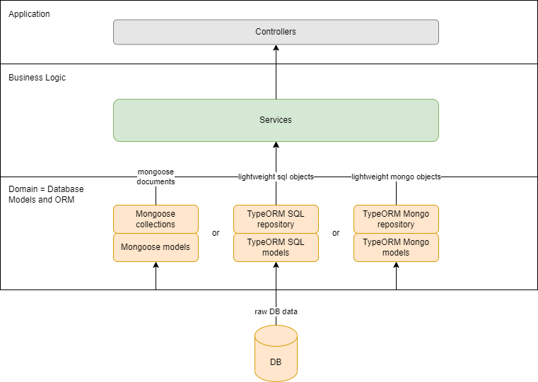

# Domain Repository

IDomainRepository is a DB-agnostic abstract repository layer over Node.JS ORM frameworks (Mongoose or TypeORM). You can think of it as an extension of Mongoose or TypeORM functionalities.

## Benefits

Properly implemented abstract repository layer solves 3 major development problems:

1. By hiding DB details, allows to easily switch between different databases. This pattern is called **DB as an implementation detail**.
2. Thanks to advanced Typescript checks, takes into consideration additional constraints such as optional and readonly, providing developers with **better intellisense and type-checking**.
3. Offers a mocked repository implementation, which simplifies unit testing and **removes the need to mock any DB dependencies**.

This library will be most useful for:

- new projects
- old projects that you want to fully or partly refactor

---

## How to use it

Example repository:

```typescript
const carRepository: IDomainRepository<ITestCar, ITestCarAttached>;
```

`IDomainRepository<Detached, Attached>` can be typed with a single domain type T, but we strongly recommend to differentiate between Detached and Attached domain types:

- `Detached` is a type of domain object that was not yet persisted. This type contains only manually assignable properties (without Id).
- `Attached` is a type of already persisted domain object. This type contains all properties including those set by DB engine (usually id).

For example:

```typescript
export type IBaseModelAttached = { id: string };
export type ITestCar = {...};
export type ITestCarAttached = ITestCar & IBaseModelAttached;
```

To type your domain objects you can use both Typescript Types and Interfaces. None is really preferred.

---

See example use-cases of IDomainRepository below:

Create:

```typescript
const testCar: ITestCar = {
  model: 'Toyota Avensis',
  engineType: TestFuelType.Gasoline,
  horsePower: 140,
  mileage: null,
  producedIn: ['Poland', 'Germany'],
  failed: true,
  features: {
    ranking: 5,
    numbers: [1, 2, 3],
    advanced: {
      serialNumber: 'test'
    }
  },
  parts: [
    { name: 'part1', year: 1999 },
    { name: 'part2', year: 2000 }
  ]
};

const createdCar = await carRepository.create(testCar);
const createdCars = await carRepository.createMany([testCar]);
```

---

Find by `SearchCriteria<T>`

```typescript
/**
 * Makes `T` properties searchable.
 * 1. `Primitives` by: value, Equals, DoesNotEqual, IsOneOfTheValues, IsNoneOfTheValues.
 * 2. `Optional` properties additionally by: Exists, DoesNotExists.
 * 3. `Strings` additionally by: StartsWith, EndsWith, Contains, DoesNotStartWith, DoesNotEndWith, DoesNotContain.
 * 4. `Numbers` and `Dates` additionally by: IsGreaterThan, IsLesserThan, IsLesserThanOrEqual, IsGreaterThanOrEqual.
 * 5. `Arrays of primitives` by: value, Equals, DoesNotEqual, HasElement, DoesNotHaveElement, HasAnyOfTheElements, HasNoneOfTheElements, HasAllElements.
 * 6. `Arrays of objects` by: HasElementThatMatches, ObjectArrayExists, ObjectArrayDoesNotExist.
 * 7. `Nested objects` by: NestedCriteria, ObjectExists, ObjectDoesNotExist.
 */
export type SearchCriteria<T> = {...}
```

Find by primitive property:

```typescript
//findOne
const foundCar = await carRepository.findOne({ model: 'Peugeot 508' });
const foundCar = await carRepository.findOneOrFail({ fullTankCapacity: 55, leftGas: 55 });

//findAll
const foundCars = await carRepository.findAll();

//equals
const foundCars = await carRepository.findAll({ model: 'Toyota Avensis', mileage: 0});
const foundCars = await carRepository.findAll({ model: SearchBy.Equals(('Mazda CX5') });
const foundCars = await carRepository.findAll({ model: SearchBy.DoesNotEqual('Mazda CX5') });

//exists
const foundCars = await carRepository.findAll({ failed: SearchBy.Exists() });
const foundCars = await carRepository.findAll({ failed: SearchBy.DoesNotExist() });

//string
const foundCars = await carRepository.findAll({ model: SearchBy.Contains('o') });
const foundCars = await carRepository.findAll({ model: SearchBy.DoesNotContain('o') });
const foundCars = await carRepository.findAll({ model: SearchBy.StartsWith('Toy') });
const foundCars = await carRepository.findAll({ model: SearchBy.DoesNotStartWith('Toy') });
const foundCars = await carRepository.findAll({ model: SearchBy.EndsWith('508') });
const foundCars = await carRepository.findAll({ model: SearchBy.DoesNotEndWith('508') });

//number and Date
const foundCars = await carRepository.findAll({ fullTankCapacity: SearchBy.IsGreaterThan(50) });
const foundCars = await carRepository.findAll({ fullTankCapacity: SearchBy.IsGreaterThanOrEqual(50) });
const foundCars = await carRepository.findAll({ fullTankCapacity: SearchBy.IsLesserThan(50) });
const foundCars = await carRepository.findAll({ fullTankCapacity: SearchBy.IsLesserThanOrEqual(50) })

//isOneOfTheValues and isNoneOfTheValues
const foundCars = await carRepository.findAll({ model: SearchBy.IsOneOfTheValues(['Mazda CX5', 'Peugeot 508']) });
const foundCars = await carRepository.findAll({ model: SearchBy.IsNoneOfTheValues(['Mazda CX5', 'Peugeot 508']) });

//complex
const foundCars = await carRepository.findAll({
   avgFuelConsumption: SearchBy.IsGreaterThanOrEqual(0),
   manufacturingLineId: SearchBy.DoesNotEqual(null)
});
```

Find by array property:

```typescript
//array
const foundCars = await carRepository.findAll({ producedIn: SearchBy.HasElement('Poland') });
const foundCars = await carRepository.findAll({ producedIn: SearchBy.DoesNotHaveElement('Poland') });
const foundCars = await carRepository.findAll({ producedIn: SearchBy.HasAnyOfTheElements(['Poland', 'Germany']) });
const foundCars = await carRepository.findAll({ producedIn: SearchBy.HasNoneOfTheElements(['France', 'Spain']) });
const foundCars = await carRepository.findAll({ producedIn: SearchBy.HasAllElements(['Spain', 'France']) });

//exists
const foundCars = await carRepository.findAll({ producedIn: SearchBy.ArrayExists() });
const foundCars = await carRepository.findAll({ producedIn: SearchBy.ArrayDoesNotExist() });
```

Find by object array property:

```typescript
//object array
const foundCars = await carRepository.findAll({
  parts: SearchBy.HasElementThatMatches<ITestPart>({
    name: SearchBy.StartsWith('w'),
    year: SearchBy.IsGreaterThan(1999)
  })
});

//object array exists
const foundCars = await carRepository.findAll({ parts: SearchBy.ObjectArrayExists() });
const foundCars = await carRepository.findAll({ parts: SearchBy.ObjectArrayDoesNotExist() });
```

Find by nested object property:

```typescript
//nested object
const foundCars = await carRepository.findAll({
  features: SearchBy.NestedCriteria<ITestFeatures>({
    advanced: SearchBy.NestedCriteria<ITestAdvanced>({
      index: SearchBy.Exists()
    })
  })
});

//nested object exists
const foundCars = await carRepository.findAll({ features: SearchBy.ObjectExists() });
const foundCars = await carRepository.findAll({ features: SearchBy.ObjectDoesNotExist() });
```

---

Update with `UpdateCriteria<T>`

```typescript
/**
 * Makes `T` non-readonly (!) properties updateable:
 * 1. `Primitives` by: Set.
 * 2. `Optional` properties by: Set, Clear.
 * 3. `Numbers` properties by: Set, Increment.
 * 4. `Arrays` by: Push, Set, PushEach, Pull, PullEach, ClearArray.
 * 5. `Arrays of objects` by: Set, Push, PushEach, Pull, PullEach, ClearObjectArray.
 * 5. `Nested objects`: by Set, UpdateCriteria, ClearObject.
 */
export type UpdateCriteria<T> = {...}
```

```typescript
//update one
const result = await carRepository.findOneAndUpdate({ model: 'Toyota' }, { model: 'Toyota_updated' });

//update all
const result = await carRepository.findAllAndUpdate({}, { leftGas: UpdateWith.Increment(10) });
const result = await carRepository.findAllAndUpdate({ horsePower: 180, mileage: 200 }, { leftGas: 8000 });

//clear
const result = await carRepository.findAllAndUpdate({ horsePower: 180 }, { leftGas: UpdateWith.Clear() });
const result = await carRepository.findAllAndUpdate({ horsePower: 180 }, { producedIn: UpdateWith.ClearArray() });
const result = await carRepository.findAllAndUpdate({ horsePower: 140 }, { parts: UpdateWith.ClearObjectArray() });
const result = await carRepository.findAllAndUpdate({ horsePower: 180 }, { features: UpdateWith.ClearObject() });

//array - push, pull
const result = await carRepository.findAllAndUpdate(
  { producedIn: SearchBy.HasElement('2') },
  { producedIn: UpdateWith.Push('3') }
);
const result = await carRepository.findAllAndUpdate(
  { producedIn: SearchBy.HasElement('2') },
  { producedIn: UpdateWith.PushEach(['4', '5']) }
);
const result = await carRepository.findAllAndUpdate(
  { producedIn: SearchBy.HasElement('2') },
  { producedIn: UpdateWith.Pull('2') }
);
const { numberOfUpdatedObjects } = await carRepository.findAllAndUpdate(
  { leftGas: SearchBy.IsLesserThanOrEqual(50) },
  { producedIn: UpdateWith.PullEach(['2', '3']) }
);

//nested set
const { numberOfUpdatedObjects } = await carRepository.findAllAndUpdate(
  { features: SearchBy.NestedCriteria<ITestFeatures>({ ranking: SearchBy.IsGreaterThanOrEqual(20) }) },
  { features: UpdateWith.Set({ ranking: 100, color: TestColor.Black, numbers: [1, 2, 3] }) }
);

//complex update
const { numberOfUpdatedObjects } = await carRepository.findAllAndUpdate(
  { model: SearchBy.Contains('ta') },
  {
    producedIn: UpdateWith.PushEach(['11', '12']),
    parts: UpdateWith.Set([{ name: 'wheel"% select', year: 2020 }]),
    leftGas: UpdateWith.Clear(),
    mileage: UpdateWith.Set(100),
    features: UpdateWith.NestedUpdate<ITestFeatures>({
      ranking: UpdateWith.Increment(1),
      numbers: UpdateWith.ClearArray(),
      color: TestColor.White,
      advanced: UpdateWith.NestedUpdate<ITestAdvanced>({
        serialNumber: 'new_sn'
      })
    })
  }
);
```

Note that typescript will throw error if you try to perform a forbidden action (updating property which is readonly, clearing property which is not optional, incrementing non-numeric property etc.).

---

## Comparison with standard approach

Classic back-end layered architecture consists of:

- controllers
- business services operating on database models
- database models and repositories (collections)

The main drawback of this approach is leaking database details (you often have to pollute your domain code and business functions with DB implementation details). This code is harder to design (DDD), harder to maintain and harder to test. The simplicity comes at the cost of violating some of the SOLID principles.

The TypeORM framework already improves this landscape, by decoupling models from database settings using Typescript decorators. Still, the business services must operate on TypeORM models and the person creating the business logic must know the exact database design (unless the custom mapper is used).



Abstract repository layer approach pushes TypeORM improvements even further, by introducing additional abstraction layer over specific DB implementation. The full architecture now consists of:

- constrollers
- domain objects with optional and readonly properties
- business services operating on domain models, using **abtract repository interface**
- specific repository implementation for selected DBs\*
- db models and **custom object-entity mappings**

\*Mongoose MongoDb and TypeORM PostgreSQL are supported right now, more implementations will be added in future.


---

## Discussion

### 1. _What are benefits of DB as an implementation detail pattern?_

The main benefit of this approach comes from SOLID's Liskov substitution principle. You should program to interfaces wherever possible (especially when you can benefit from alternative implementation, for example during testing). You should treat DB technology as detail of your implementation and not your foundational architectural assumption. This obviously raises few doubts and questions:

- _I like my current database. Why would I ever change it?_ Because of market change, new company policy, new features needed, possible savings, scalability factors, team knowledge, etc. There are plenty of reasons, especially in later phases of development.

- _My current database technology matters._ The real question is: _when_ it matters? The success of the your project will mostly depend on your architecture, code quality, ability to change, complexity of your data model and design patterns used. The DB technology can only be a deciding factor in huge ecosystems and real edge cases. But even then it is better to have abstracted data layer.

- _I am using advanced database features._ Offloading too much work to DB engine is a dangerous practice, which can lead to huge maintenance problems. Remember that custom procedures and triggers are costly, maintainance and performance wise. Complex DB designs can be often simplified and most use-cases handled in code.

- _What if I never change my DB?_ Then you still can benefit from domain driven design and simplified testing.

### 2. _Which DB features does IDomainRepository support?_

IDomainRepository supports:

- basic CRUD functions, similarly to Mongoose and TypeORM
- all DB features that are transparent to repository layer (indexes, constraints, triggers, etc.)

IDomainRepository does not support:

- creating and running functions, procedures, views
- creating triggers
- executing custom queries

If you need any of those use-cases, create an additional service with direct dependency to Mongoose or TypeORM repository.

### 3. _Does IDomainRepository support nested objects and nested arrays?_

Yes, IDomainRepository supports nested objects and nested arrays.
If you wonder how those are implemented in concrete databases:

- nested primitive arrays:
  - MongoDb: supported out-of-the-box
  - SQL: as special array column type
- nested objects:
  - MongoDb: supported out-of-the-box
  - SQL: as additional table with one-to-one relationship
- nested object arrays:
  - MongoDb: supported out-of-the-box
  - SQL: as additional table with one-to-many relationship

### 4. _Which functions does IDomainRepository support?_

IDomainRepository supports basic functions that are replicable to all possible DBs and cover vast majority of DB use-cases.

Supported functions have been grouped by type of interface (according to SOLID's Interface segregation principle):

- `IReadDomainRepository<invariant T>`

  - findOne()
  - findOneOrFail()
  - findAll()
  - countAll()

- `IWriteDomainRepository<invariant T>`

  - create()
  - createMany()
  - findOneAndUpdate()
  - findAllAndUpdate()
  - findOneAndDelete()
  - findAllAndDelete()

- `IDomainRepository<invariant T>`:
  - all of above

To be added:

- transactions
- find options: skip(), take(), sort()

Out of scope:

- findById() - not replicable (some SQL tables have no id), instead use findOne({ id }) when necessary
- DB-specific update and search methods: not replicable to other DBs. If you need any of those use-cases, create an additional service with direct dependency to Mongoose or TypeORM repository.

### 5. _Is IDomainRepository performant?_

Yes, with small exceptions.

The performance of MongoDb searches and queries is equal to the performance of native Mongoose methods.

The performance of SQL searches and direct updates is equal to the performance of native TypeORM methods.

Note! When updating nested arrays and objects in SQL database, we cannot use direct queries (mapping to additional tables is too complicated). Instead we are using save() method which can be slow in some circumstances (for example when updating a large number or nested elements). In most use-cases this performance drop is negligible for updates (from user's UX perspective). In case, where it is not, please use additional service with direct dependency to Mongoose or TypeORM repository.

### 6. _Why should I map DB objects to domain objects?_

Because of SOLID's Single-responsibility principle. You should not operate on objects, whose functions you do not need (for example heavy Mongoose documents). You should never pass more data than you need (for simplicity and security purposes). Also, the mapping gives you additional flexibility, decouples DB implementation from domain model, and allows to change both domain and DB models asynchronously, without breaking the contract.

For example: we recommend you to have all Domain objects inherited from base IDomainModel interface (inheritance pattern should be mostly limited to models). Hence, all domain models should have ID of type string (as this is mappable to both MongoDB \_id and SQL numeric IDs). Without mappings, it would be impossible to have the same id mapped to different data types in different databases.

### 7. _Why should I care for optional and readonly properties?_

The same reason we care for typing variables: to get most of Typescript compile-time checks. The better designed is your domain model, the better for everyone. Our repository checks that you do not run forbidden actions:

- check if property exists, if that property is _not_ optional
- clear property (delete or set to NULL depending on DB), if that property is _not_ optional
- update property, if that property is readonly

### 8. _I already use specific businesss repositories. Can I switch to IDomainRepository?_

Yes. The two main approaches to implementing repositories are:

- using generic repositories (Mongoose collection, TypeORM repository) in more specific business functions (or CQRS queries / commands)

```typescript
class OrderService {
  public findOrder(orderName: string): IOrderAttached {
    return this.genericRespository.findOne({ name: orderName });
  }
}
```

- using specific repositories for each type of db entity, in business functions (or CQRS queries / commands)

```typescript
class OrderService {
  public findOrder(orderName: string): IOrderAttached {
    return this.orderRepository.findOrderByName(orderName);
  }
}
```

The latter approach has important advantages over the former one, especially when each repository has a dedicated interface which can be implemented (mocked) for testing purposes. But, it is also more verbose.

IDomainRepository can be also used with specific repository. In this case, leave your repository interface untouched, but change its implementation by using our IDomainRepository as its sub-dependency.

### 9. _Can IDomainRepository be used with DI framework?_

Of course. Please see our documentation for concrete implementations:

- MongoDb LINK!!!!
- TypeORM LINK!!!!
